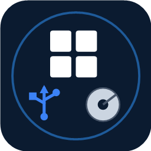

# DriveForge

**Create Windows USB drives, clone this PC, back it up, and check drive health — free, portable, offline.**

Free • Portable (no install) • No ads • No telemetry • Works offline

---

## What it does

DriveForge is a single-file Windows tool that turns common, normally-complicated
disk jobs into a few clicks:

- **Create a Windows USB** from an ISO / WIM / ESD (BIOS + UEFI bootable).
- **Clone this PC → portable USB / external drive** (Windows To Go style) — boots like your own PC, with your apps and settings.
- **Clone this PC → internal disk** (a normal Windows install on another drive).
- **Back up this PC to an image file (.wim)** — full or incremental restore points.
- **Restore a saved image** back onto a drive.
- **Drive Diagnostic Center** — health, SMART, speed test, file-system scan, repair, and a portable tool kit.

Extra options: BitLocker encryption with a saved recovery key, bypass Windows 11
requirements / Microsoft-account requirement for fresh installs, verify data
after writing, compact images, and **scheduled automatic clones** (an
unattended backup that runs when the drive is connected).

## Privacy

- **No ads, no telemetry, no accounts.** Nothing about you is collected or sent anywhere.
- **Works offline.** Core features (create from a local ISO, clone, back up, recover, wipe, diagnose) need no internet — the clone engine (wimlib) is built in. Only optional actions like downloading an ISO or the Ventoy engine use the network.

## Requirements

- Windows 10 / 11 (x64).
- Run as **Administrator** (creating/cloning drives needs it).
- The app is self-contained — no .NET install required.

## How to use

1. **Choose a task** (top-left dropdown).
2. **Pick the source** (an ISO for installs; "this PC" for clones/backups).
3. **Pick the target drive** — the colored verdict tells you if it's suitable. Your system disk is hidden so you can't pick it by mistake.
4. (Optional) tick options in step 4 — hover any option for an explanation.
5. Press the green button. When it finishes, boot the target PC and pick the drive from the boot menu (usually F12 / F9 / Esc / F2).

## License

- DriveForge is **free and open source software**, licensed under the **GNU General
  Public License v3.0 (GPLv3)** — see [LICENSE.txt](LICENSE.txt). You may use, study,
  modify, and redistribute it under the terms of the GPLv3. Copyright (C) 2026 ForgeLabsSoft.
- Bundled clone engine **wimlib 1.14.4**: LGPL-3.0 (library) / GPL-3.0 (imagex tool),
  used unmodified and invoked as a separate process. See
  [THIRD-PARTY-NOTICES.txt](THIRD-PARTY-NOTICES.txt).
- **Trademark.** The DriveForge name and logo are brand assets of ForgeLabsSoft and are
  **not** covered by the GPLv3 — the license applies to the source code only. Forks and
  redistributions must use a different name and logo and must not imply endorsement by
  ForgeLabsSoft.

## Support

DriveForge is free. If it helped you, you can support its development:

**☕ [Support on Ko-fi](https://ko-fi.com/driveforge)** — pay by card, Apple/Google Pay or PayPal, no account needed. Thank you!
