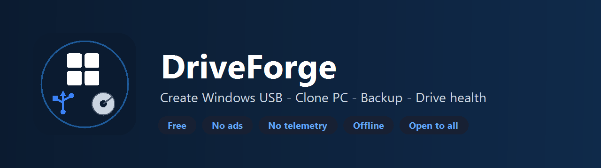
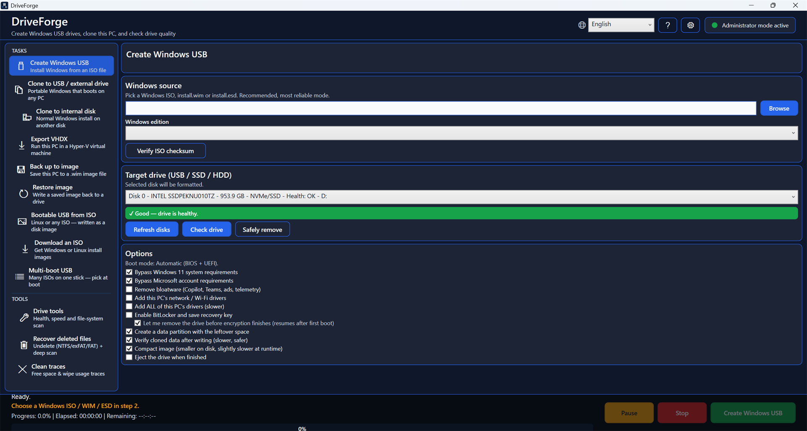
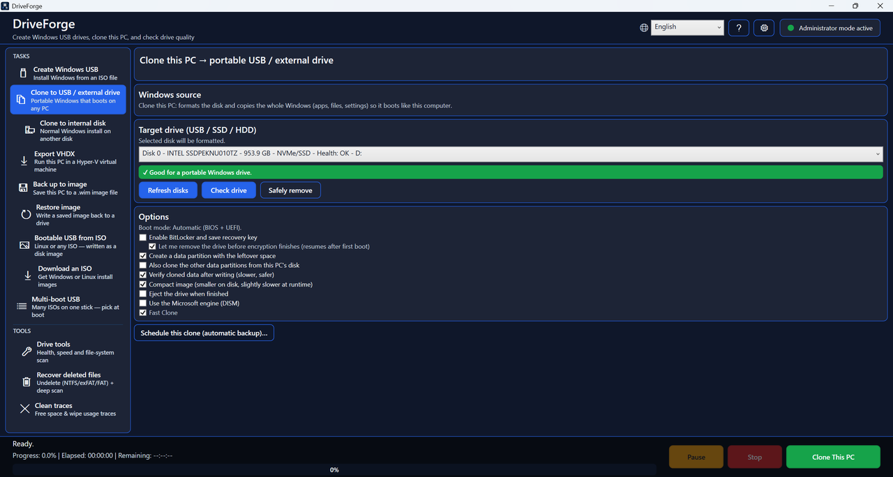
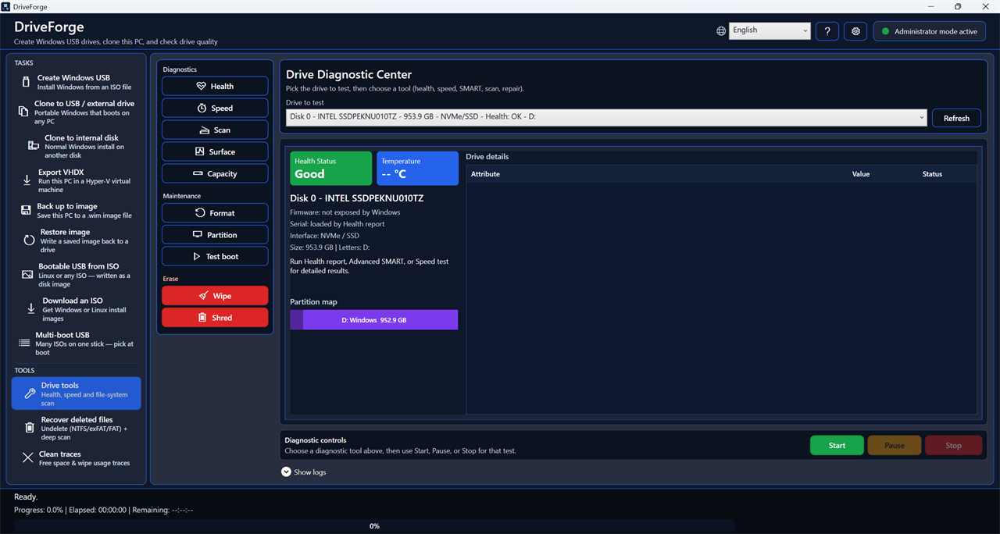
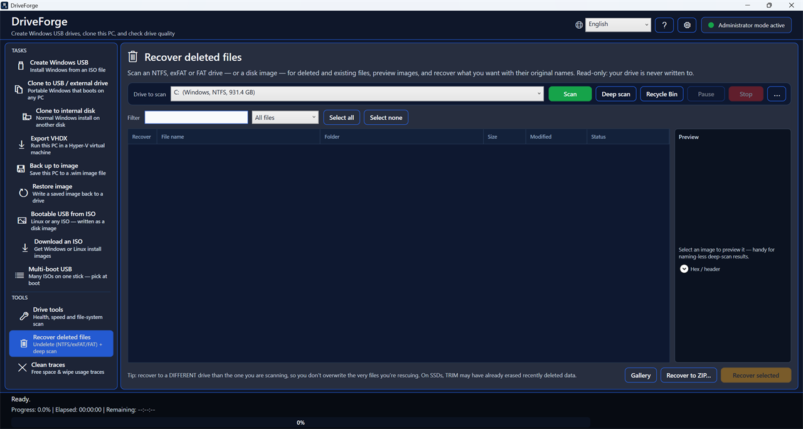
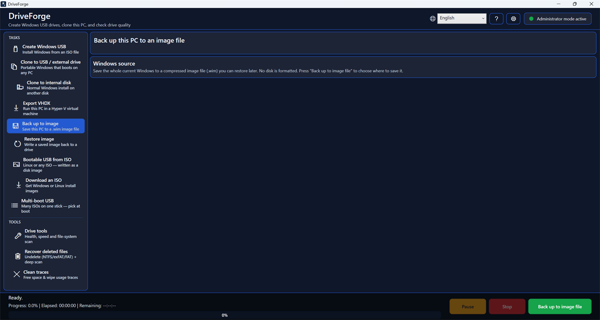

<div align="center">



# DriveForge

**Create Windows USB drives, clone this PC, back it up, and check drive health — free, portable, offline.**

Free • Portable (no install) • No ads • No telemetry • Works offline

[**forgelabssoft.com**](https://forgelabssoft.com) · [Download](https://github.com/ForgeLabsSoft/driveforge/releases/latest) · [Report a problem](https://github.com/ForgeLabsSoft/driveforge/issues)

</div>

---

<div align="center">



</div>

<table>
<tr>
<td width="50%"><br><sub><b>Clone this PC</b> to a drive that boots anywhere.</sub></td>
<td width="50%"><br><sub><b>Drive Diagnostic Center</b> — health, SMART, speed, surface scan.</sub></td>
</tr>
<tr>
<td width="50%"><br><sub><b>Recover deleted files</b> — undelete or deep-scan.</sub></td>
<td width="50%"><br><sub><b>Back up this PC</b> to a single image file.</sub></td>
</tr>
</table>

---

## What it does

DriveForge is a single-file Windows tool that turns common, normally-complicated
disk jobs into a few clicks. Think of it as **a bootable-USB maker + a PC-clone tool + an undeleter +
a drive doctor, in one portable exe** — free, offline, in 17 languages.

- **Create a Windows USB** from an ISO / WIM / ESD (BIOS + UEFI bootable).
- **Clone this PC → portable USB / external drive** (Windows To Go style) — boots like your own PC, with your apps and settings.
- **Clone this PC → internal disk** (a normal Windows install on another drive).
- **Back up this PC to an image file (.wim)** — full or incremental restore points.
- **Restore a saved image** back onto a drive.
- **Recover deleted files** — undelete on NTFS / exFAT / FAT, plus a deep-scan "carving" mode that finds files even after the filesystem entry is gone.
- **Bootable USB from any ISO** — write Linux or any disk-image ISO straight to a stick.
- **Multi-boot USB** — put many ISOs on one stick and pick at boot (Ventoy).
- **Securely erase a drive**, wipe free space, shred individual files, or clean usage traces.
- **Partition tools** — create, delete, resize, move, convert (MBR ↔ GPT), set active, find lost partitions.
- **Drive Diagnostic Center** — health, SMART, speed test, file-system scan, repair, and a portable tool kit.

Extra options: BitLocker encryption with a saved recovery key, bypass Windows 11
requirements / Microsoft-account requirement for fresh installs, verify data
after writing, compact images, and **scheduled automatic clones** (an
unattended backup that runs when the drive is connected).

## Download

Grab the latest **`DriveForge.exe`** from the [**Releases**](https://github.com/ForgeLabsSoft/driveforge/releases/latest) page — a single self-contained file, no install.

> **Code signing:** DriveForge has applied to the [SignPath Foundation](https://signpath.org) free code-signing program for open-source projects. Until a signed build is published, Windows SmartScreen may warn on first run — click **More info → Run anyway**. Builds are produced from source by GitHub Actions; verify the SHA-256 in `SHA256SUMS.txt`, and verify the build provenance cryptographically with:
>
> ```
> gh attestation verify DriveForge.exe --repo ForgeLabsSoft/driveforge
> ```

## Privacy

- **No ads, no telemetry, no accounts.** Nothing about you is collected or sent anywhere. There is no crash
  reporter, no usage counter, and no "phone home" — the app never contacts us on its own.
- **Works offline.** Core features (create from a local ISO, clone, back up, recover, wipe, diagnose) need no internet — the clone engine (wimlib) is built in. Only optional actions like downloading an ISO or the Ventoy engine use the network.
- **Reporting a problem is entirely manual.** *Settings → Report a problem* (and the offer shown after a failed
  operation) only **opens** something — the bug form on GitHub, or a pre-addressed email — and nothing is submitted
  until you send it yourself. Specifically:
  - The **GitHub** link carries only your DriveForge version and your Windows build, so the form's two required
    fields are filled in. Error text is deliberately **not** put in the link: GitHub issues are public, and this
    app's error messages quote full file paths, which on Windows contain your account name.
  - The **email** option puts the error text in the message body for you to read before sending, with your
    user-profile path replaced by `%UserProfile%`. It goes to one address, not a public tracker.
  - Log files are never attached automatically. You choose what to include.

## Requirements

- Windows 10 / 11 (x64).
- Run as **Administrator** (creating/cloning drives needs it).
- The app is self-contained — no .NET install required.

## How to use

1. **Choose a task** (top-left dropdown).
2. **Pick the source** (an ISO for installs; "this PC" for clones/backups).
3. **Pick the target drive** — the colored verdict tells you if it's suitable. Your system disk is hidden so you can't pick it by mistake.
4. (Optional) tick options in step 4 — hover any option for an explanation.
5. Press the green button. When it finishes, boot the target PC and pick the drive from the boot menu (usually F12 / F9 / Esc / F2).

## Note: antivirus during PC cloning

When you clone a running Windows install to another drive, the clone needs a one-time
first-boot repair of the built-in Store apps. Third-party antivirus installed inside the
clone would start during that offline first boot and block the repair. To let it finish,
DriveForge can **temporarily disable third-party antivirus services in the clone's offline
registry** (never on your running PC) and writes a `Re-Enable-Antivirus.cmd` into the clone
so you can turn protection back on — or reinstall it — afterward.

This only happens on the clone path when a first-boot repair is needed (a *faithful* clone
skips it), it is reversible, and **Windows Defender is left untouched**.

## License

- DriveForge is **free and open source software**, licensed under the **GNU General
  Public License v3.0 (GPLv3)** — see [LICENSE.txt](LICENSE.txt). You may use, study,
  modify, and redistribute it under the terms of the GPLv3. Copyright (C) 2026 ForgeLabsSoft.
- Bundled clone engine **wimlib 1.14.4**: LGPL-3.0 (library) / GPL-3.0 (imagex tool),
  used unmodified and invoked as a separate process. See
  [THIRD-PARTY-NOTICES.txt](THIRD-PARTY-NOTICES.txt).
- **Trademark.** The DriveForge name and logo are brand assets of ForgeLabsSoft and are
  **not** covered by the GPLv3 — the license applies to the source code only. Forks and
  redistributions must use a different name and logo and must not imply endorsement by
  ForgeLabsSoft.

## Support

DriveForge is free. If it helped you, you can support its development:

**☕ [Support on Ko-fi](https://ko-fi.com/driveforge)** — pay by card, Apple/Google Pay or PayPal, no account needed. Thank you!
