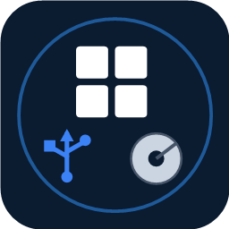
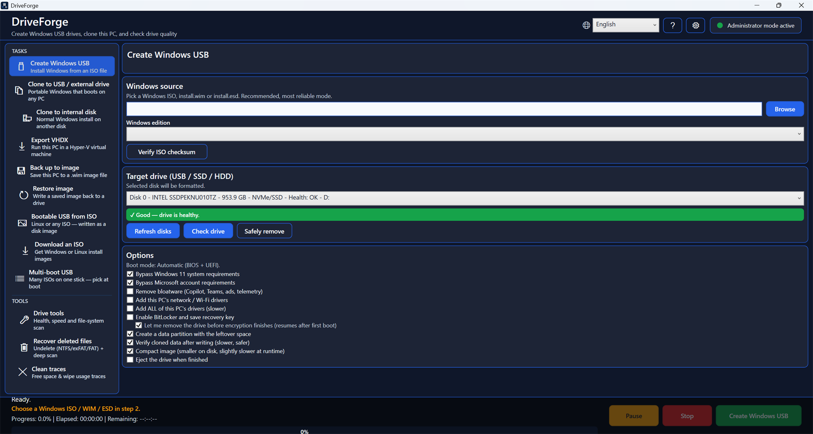
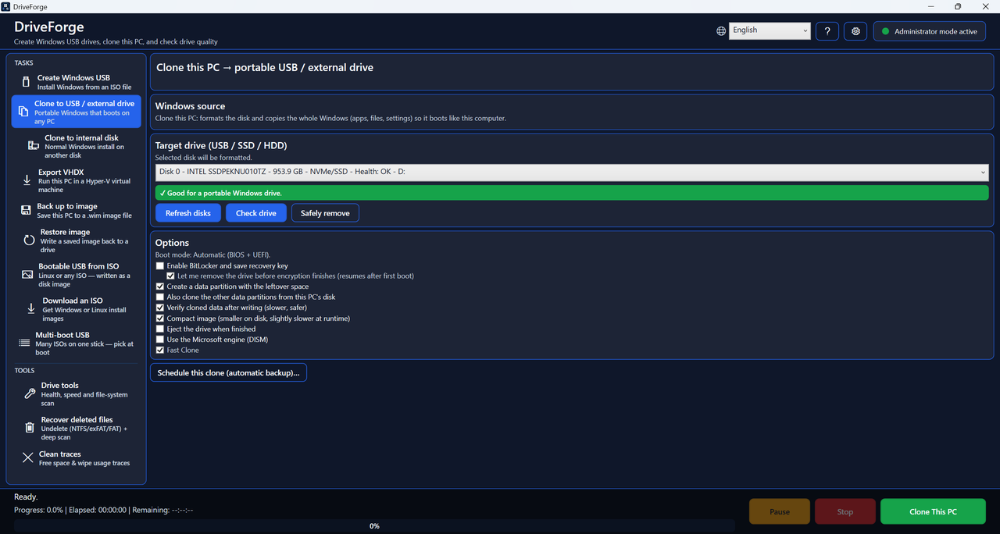
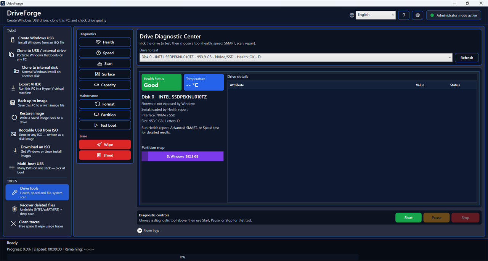
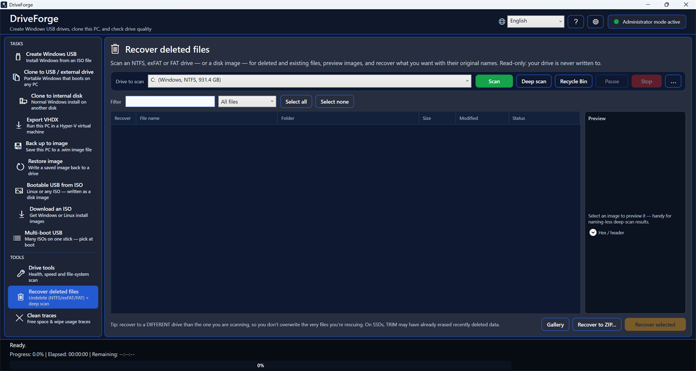
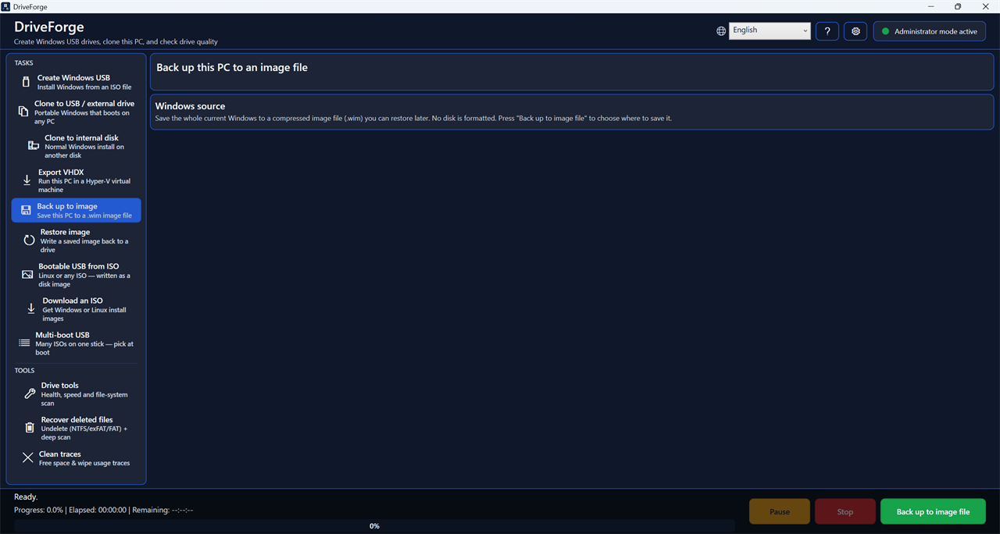

<div align="center">



# DriveForge

**Create Windows USB drives, clone this PC, back it up, and check drive health — free, portable, offline.**

Free • Portable (no install) • No ads • No telemetry • Works offline

[**forgelabssoft.com**](https://forgelabssoft.com) · [Download](https://github.com/ForgeLabsSoft/driveforge/releases/latest) · [Report a problem](https://github.com/ForgeLabsSoft/driveforge/issues)

</div>

---

<div align="center">



</div>

<table>
<tr>
<td width="50%"><br><sub><b>Clone this PC</b> to a drive that boots anywhere.</sub></td>
<td width="50%"><br><sub><b>Drive Diagnostic Center</b> — health, SMART, speed, surface scan.</sub></td>
</tr>
<tr>
<td width="50%"><br><sub><b>Recover deleted files</b> — undelete or deep-scan.</sub></td>
<td width="50%"><br><sub><b>Back up this PC</b> to a single image file.</sub></td>
</tr>
</table>

---

## What it does

DriveForge is a single-file Windows tool that turns common, normally-complicated
disk jobs into a few clicks. Think of it as **a bootable-USB maker + a PC-clone tool + an undeleter +
a drive doctor, in one portable exe** — free, offline, in 17 languages.

- **Create a Windows USB** from an ISO / WIM / ESD (BIOS + UEFI bootable).
- **Clone this PC → portable USB / external drive** (Windows To Go style) — boots like your own PC, with your apps and settings.
- **Clone this PC → internal disk** (a normal Windows install on another drive).
- **Back up this PC to an image file (.wim)** — full or incremental restore points.
- **Restore a saved image** back onto a drive.
- **Recover deleted files** — undelete on NTFS / exFAT / FAT, plus a deep-scan "carving" mode that finds files even after the filesystem entry is gone.
- **Bootable USB from any ISO** — write Linux or any disk-image ISO straight to a stick, to one drive or to several in a row.
- **Multi-boot USB** — put many ISOs on one stick and pick at boot (Ventoy).
- **Securely erase a drive**, wipe free space, shred individual files, or clean usage traces.
- **Partition tools** — create, delete, resize, move, convert (MBR ↔ GPT), set active, find lost partitions.
- **Drive Diagnostic Center** — health, SMART, speed test, file-system scan, repair, and a portable tool kit.

Extra options: BitLocker encryption with a saved recovery key, bypass Windows 11
requirements / Microsoft-account requirement for fresh installs, verify data
after writing, compact images, and **scheduled automatic clones** (an
unattended backup that runs when the drive is connected).

## Download

Grab the latest **`DriveForge.exe`** from the [**Releases**](https://github.com/ForgeLabsSoft/driveforge/releases/latest) page — a single self-contained file, no install.

Or with the Windows Package Manager:

```
winget install ForgeLabsSoft.DriveForge
```

> **Not code-signed.** Windows SmartScreen warns on first run — click **More info → Run anyway**. Why, and
> what is offered instead, is in [Code signing policy](#code-signing-policy) below.

## Code signing policy

DriveForge is **not code-signed today**, and this section says plainly where that stands.

**Today.** Releases are unsigned. In place of a signature, every release is built from public source by
GitHub Actions rather than on a developer's machine, and carries a build-provenance attestation tying the
binary to the exact commit that produced it. Both are checkable by anyone:

```
Get-FileHash DriveForge.exe -Algorithm SHA256        # compare with SHA256SUMS.txt
gh attestation verify DriveForge.exe --repo ForgeLabsSoft/driveforge
```

**When DriveForge is signed.** The intended arrangement is: *Free code signing provided by SignPath.io,
certificate by SignPath Foundation.* That is policy, not fact — the application was submitted in June 2026
and declined in July 2026, because the project had not reached the level of public recognition the
programme asks for. It will be submitted again, and this text will change on the day it is true, not before.

**Roles.** One person writes DriveForge, so one party holds every role: **Author**, **Reviewer** and
**Approver** — ForgeLabsSoft, <support@forgelabssoft.com>. Every release would be approved by hand; nothing
would be signed automatically.

**Privacy statement.** This program will not transfer any information to other networked systems unless
specifically requested by the user or the person installing or operating it.

Some antivirus tools also flag the binary. A program that writes raw disk sectors and makes bootable drives
looks, to a scanner, a lot like something that should not.
[Report a false positive](https://github.com/ForgeLabsSoft/driveforge/issues) if you hit one.

## Uninstalling

There is no installer, so there is nothing to uninstall — but everything DriveForge can leave behind is
listed here, so none of it has to stay.

1. **The program.** Delete `DriveForge.exe`. It is never copied to Program Files and never registered with
   Windows. Installed through the Windows Package Manager instead? `winget uninstall ForgeLabsSoft.DriveForge`
2. **Settings and logs.** Delete `%LocalAppData%\DriveForge` — it holds `settings.json`,
   `health-history.json`, `crash.log` and `dism.log`, and nothing else.
3. **A scheduled clone, only if you made one.** An ordinary Windows scheduled task named
   `DriveForge Auto Clone`: remove it in Task Scheduler, or
   `schtasks /Delete /TN "DriveForge Auto Clone" /F`

Nothing else exists: no registry entries of its own, no service, no driver, nothing added to startup.
## Privacy

- **No ads, no telemetry, no accounts.** Nothing about you is collected or sent anywhere. There is no crash
  reporter, no usage counter, and no "phone home" — the app never contacts us on its own.
- **Works offline.** Core features (create from a local ISO, clone, back up, recover, wipe, diagnose) need no internet — the clone engine (wimlib) is built in. Only optional actions like downloading an ISO or the Ventoy engine use the network.
- **Reporting a problem is entirely manual.** *Settings → Report a problem* (and the offer shown after a failed
  operation) only **opens** something — the bug form on GitHub, or a pre-addressed email — and nothing is submitted
  until you send it yourself. Specifically:
  - The **GitHub** link carries only your DriveForge version and your Windows build, so the form's two required
    fields are filled in. Error text is deliberately **not** put in the link: GitHub issues are public, and this
    app's error messages quote full file paths, which on Windows contain your account name.
  - The **email** option puts the error text in the message body for you to read before sending, with your
    user-profile path replaced by `%UserProfile%`. It goes to one address, not a public tracker.
  - Log files are never attached automatically. You choose what to include.

## Requirements

- Windows 10 / 11 (x64).
- Run as **Administrator** (creating/cloning drives needs it).
- The app is self-contained — no .NET install required.

## How to use

1. **Choose a task** from the list down the left-hand side.
2. **Pick the source** (an ISO for installs; "this PC" for clones/backups).
3. **Pick the target drive** — the colored verdict tells you if it's suitable. The drive you are running Windows from is listed last and marked *RUNNING WINDOWS (no format/erase)*; every task that would erase a disk refuses it.
4. (Optional) tick options in step 4 — hover any option for an explanation.
5. Press the green button. When it finishes, boot the target PC and pick the drive from the boot menu (usually F12 / F9 / Esc / F2).

## Note: antivirus during PC cloning

When you clone a running Windows install to another drive, the clone needs a one-time
first-boot repair of the built-in Store apps. Third-party antivirus installed inside the
clone would start during that offline first boot and block the repair. To let it finish,
DriveForge can **temporarily disable third-party antivirus services in the clone's offline
registry** (never on your running PC) and writes a `Re-Enable-Antivirus.cmd` into the clone
so you can turn protection back on — or reinstall it — afterward.

This only happens on the clone path when a first-boot repair is needed (a *faithful* clone
skips it), it is reversible, and **Windows Defender is left untouched**.

There is a second, unrelated case: some security suites block Windows from mounting a registry
hive out of an image at all. Everything that personalises a drive after it is written needs
that — the portable-Windows flags, the Windows 11 requirement bypass, the local-account
bypass, bloatware removal — and `bcdboot` needs it to create the boot record. DriveForge
checks before it erases anything and tells you what will be missing if you carry on. If a
drive comes out without those settings, or without a boot record, pausing that protection for
a few minutes and running the task again is usually all it takes.

## License

- DriveForge is **free and open source software**, licensed under the **GNU General
  Public License v3.0 (GPLv3)** — see [LICENSE.txt](LICENSE.txt). You may use, study,
  modify, and redistribute it under the terms of the GPLv3. Copyright (C) 2026 ForgeLabsSoft.
- Bundled clone engine **wimlib 1.14.4**: LGPL-3.0 (library) / GPL-3.0 (imagex tool),
  used unmodified and invoked as a separate process. See
  [THIRD-PARTY-NOTICES.txt](THIRD-PARTY-NOTICES.txt).
- **Trademark.** The DriveForge name and logo are brand assets of ForgeLabsSoft and are
  **not** covered by the GPLv3 — the license applies to the source code only. Forks and
  redistributions must use a different name and logo and must not imply endorsement by
  ForgeLabsSoft.

## Support

DriveForge is free. If it helped you, you can support its development:

**☕ [Support on Ko-fi](https://ko-fi.com/driveforge)** — pay by card, Apple/Google Pay or PayPal, no account needed. Thank you!
